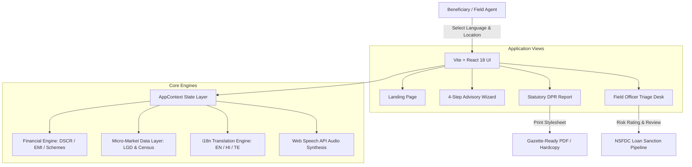

# GraminAI (ग्रामीण एआई / గ్రామీణ ఎఐ)

> **AI-Driven Hyper-Local Business Advisory & Concessional Underwriting Platform**  
> *Developed for Smart India Hackathon (SIH) · Problem Statement ID: **SIH26091***  
> *Ministry of Social Justice and Empowerment (MSJE) · National Scheduled Castes Finance and Development Corporation (NSFDC)*

---

## 🌟 Executive Summary

In rural and semi-urban India, aspiring micro-entrepreneurs from Scheduled Castes (SC) and Other Backward Classes (OBC) frequently face major barriers when applying for concessional government loans. Complex Detailed Project Reports (DPR), lack of local demand intelligence, language barriers, and opaque underwriting criteria lead to high rejection rates or predatory middlemen.

**GraminAI** addresses this challenge with a **deterministic, zero-hallucination pre-application advisory portal**. It empowers rural applicants and field verification officers to evaluate micro-enterprise viability, compute statutory loan eligibility, generate gazette-ready credit appraisal reports, and audit risk factors grounded in hyper-local infrastructure and Census/LGD data.

---

## 🚀 Key Features

### 1. 🧮 Deterministic Financial & Underwriting Engine
- **Strict Mathematical Computation**: Avoids synthetic LLM financial hallucinations by enforcing statutory guidelines from NSFDC and NBCFDC.
- **Statutory Schemes Supported**:
  - **NSFDC Micro Finance Scheme (Tier I)**: For projects up to ₹1,40,000 (10% beneficiary margin, 90% loan at 6.5% p.a., 3-year tenure, 3-month moratorium).
  - **NSFDC Term Loan Scheme (Tier II)**: For projects up to ₹50,00,000 (10% margin, 90% loan at 8.0% p.a., 7-year tenure, 6-month moratorium).
- **Credit Health Metrics**: Real-time Debt Service Coverage Ratio (DSCR), monthly and quarterly EMI projections, and operational break-even analysis.

### 2. 🗺️ Hyper-Local Geographic & Infrastructure Grounding
- Hierarchical location resolution: **State ➔ District ➔ Mandal ➔ Gram Panchayat ➔ Village**.
- Integrates authentic **Local Government Directory (LGD) codes**, Census demographic populations, and household density.
- Computes micro-market feasibility based on:
  - Distance to nearest wholesale mandi / market town (in km)
  - Road connectivity (National Highway node, MDR 2-lane, paved all-weather)
  - Power availability (24-hour domestic, 3-phase agricultural schedule)
  - Irrigation and water sources (canal, borewell, groundwater)

### 3. 📝 4-Step Interactive Advisory Wizard
- **Step 1: Local Infrastructure**: Select applicant's village and review local road, water, and power indices.
- **Step 2: Beneficiary Profile & Margin**: Input applicant community and available margin capital (₹10,000 to ₹10,00,000) with dynamic leverage preview.
- **Step 3: Enterprise Selection & Asset Audit**: Choose from curated enterprise archetypes (Dairy & Chilling, Kirana Mart, SHG Tailoring, Solar Spice Mill, EV/Two-Wheeler Service) and verify physical assets (land, training certificates, power links).
- **Step 4: Viability & Underwriting Appraisal**: Instant sensitivity stress-testing, SWOT matrix analysis, and credit score classification.

### 4. 📄 Gazette-Ready Detailed Project Report (DPR)
- Produces an official, institutional-grade Detailed Project Report (DPR) and underwriting appraisal sheet.
- Includes CAPEX & OPEX schedules, repayment calendars, DSCR verification badges, and statutory clearance checklists.
- **Print & PDF Optimization**: Built-in `@media print` CSS formats the document cleanly for physical submission to district branch officers.

### 5. 🗣️ Multilingual Voice Assistance & Accessibility
- Complete tri-lingual support:
  - **English** (`en`)
  - **Hindi** (`hi` — हिंदी)
  - **Telugu** (`te` — తెలుగు)
- Integrated Web Speech API (`SpeechSynthesis`) narration modal for low-literacy beneficiaries.

### 6. 🛡️ Field Officer Triage & Appraisal Desk
- Dedicated portal for field verification officers and district managers.
- Real-time pipeline monitoring of submitted pre-applications.
- Risk-rating flags (Low, Moderate, High risk) and one-click application status management (Pending Verification, Field Review, Sanction Recommended).

---

## 🏗️ System Architecture



---

## 💻 Technology Stack

| Layer | Technology | Description |
| :--- | :--- | :--- |
| **Frontend Framework** | [React 18](https://react.dev/) | Component architecture and stateful UI |
| **Build Tool** | [Vite 6](https://vitejs.dev/) | High-performance bundling and HMR dev server |
| **Styling** | [Tailwind CSS](https://tailwindcss.com/) (CDN) | Custom institutional palette and typography tokens |
| **Routing** | [React Router v6](https://reactrouter.com/) | Client-side routing across all portal views |
| **Icons & UI** | [Lucide React](https://lucide.dev/) & Material Symbols | Accessible visual indicators and navigation icons |
| **Effects** | [Canvas Confetti](https://www.npmjs.com/package/canvas-confetti) | Milestone celebrations upon passing credit checks |
| **Speech** | Web Speech API (`SpeechSynthesis`) | Browser-native audio narration in EN, HI, and TE |

---

## 📁 Repository Structure

```text
├── public/
│   └── favicon.svg              # GraminAI SVG favicon
├── src/
│   ├── components/
│   │   ├── AudioModal.jsx       # Multilingual voice narration modal
│   │   └── Navbar.jsx           # Global navigation with language selector
│   ├── context/
│   │   └── AppContext.jsx       # Global application state, speech, and filter hooks
│   ├── data/
│   │   └── mockData.js          # LGD hierarchy, business archetypes, and officer data
│   ├── engine/
│   │   └── financialEngine.js   # Deterministic financial math (DSCR, EMI, NSFDC rules)
│   ├── i18n/
│   │   └── translations.js      # English, Hindi, and Telugu localization dictionary
│   ├── pages/
│   │   ├── LandingPage.jsx      # Public overview, scheme benefits, and interactive simulator
│   │   ├── WizardPage.jsx       # 4-step advisory assessment wizard
│   │   ├── ReportPage.jsx       # Official appraisal report and gazette DPR generator
│   │   └── TriageDeskPage.jsx   # Officer desk for reviewing and approving applications
│   ├── App.jsx                  # Root router layout with header, footer, and modals
│   ├── index.css                # Tailwind base, custom scrollbar, and @media print CSS
│   └── main.jsx                 # React DOM root mounting
├── index.html                   # HTML entry point with Google Fonts and Tailwind config
├── package.json                 # Project dependencies and execution scripts
├── package-lock.json            # Deterministic dependency lockfile
├── vite.config.js               # Vite server and React plugin configuration
└── .gitignore                   # Ignore rules for node_modules, dist, and environment files
```

---

## ⚙️ Getting Started

### Prerequisites
- **Node.js**: v18.0.0 or later (v20+ LTS recommended)
- **npm**: v9.0.0 or later

### 1. Clone the Repository
```bash
git clone -b Ronit https://github.com/Ronit-092/SIH26091.git
cd SIH26091
```

### 2. Install Dependencies
```bash
npm install
```

### 3. Run Development Server
```bash
npm run dev
```
Open your browser and navigate to `http://localhost:5173`.

### 4. Build for Production
```bash
npm run build
```
Generates production bundles into the `dist/` directory.

### 5. Preview Production Build
```bash
npm run preview
```
Spins up Vite's local static server to preview the production build.

---

## 📊 Business Models & Archetypes Evaluated

1. **Commercial Dairy & Bulk Chilling**: 10-animal crossbred unit with automated milking and BMC link.
2. **Rural Kirana & Agri-Input Mart**: Direct APMC procurement and fertilizer/seed distribution retail node.
3. **Garment Manufacturing & SHG Tailoring**: Motorized sewing cluster catering to local school and festive uniforms.
4. **Custom Hiring & Solar Spice/Flour Mill**: Decentralized solar-powered pulverizer and agro-processing equipment.
5. **Two-Wheeler & EV Service Center**: Rural mobility hub equipped with battery swap docks and diagnostic tools.

---

## 📜 Statutory Alignment & Compliance

- **Credit Norms**: Compliant with NSFDC lending guidelines (10% borrower margin / 90% concessional credit ratio).
- **Interest Subvention**: Modeled for simple interest under Micro-Credit Finance (6.5% p.a.) and Term Loans (8.0% p.a.).
- **Moratorium Policy**: 3 to 6 months principal holiday to support enterprise stabilization before repayment cycles commence.
- **Geospatial Standards**: Integrated with MoPR Local Government Directory (LGD) census codes.

---

## 📄 License & Attribution

This project was developed for the **Smart India Hackathon (SIH26091)** under the initiative of the **Ministry of Social Justice and Empowerment (MSJE)**.
